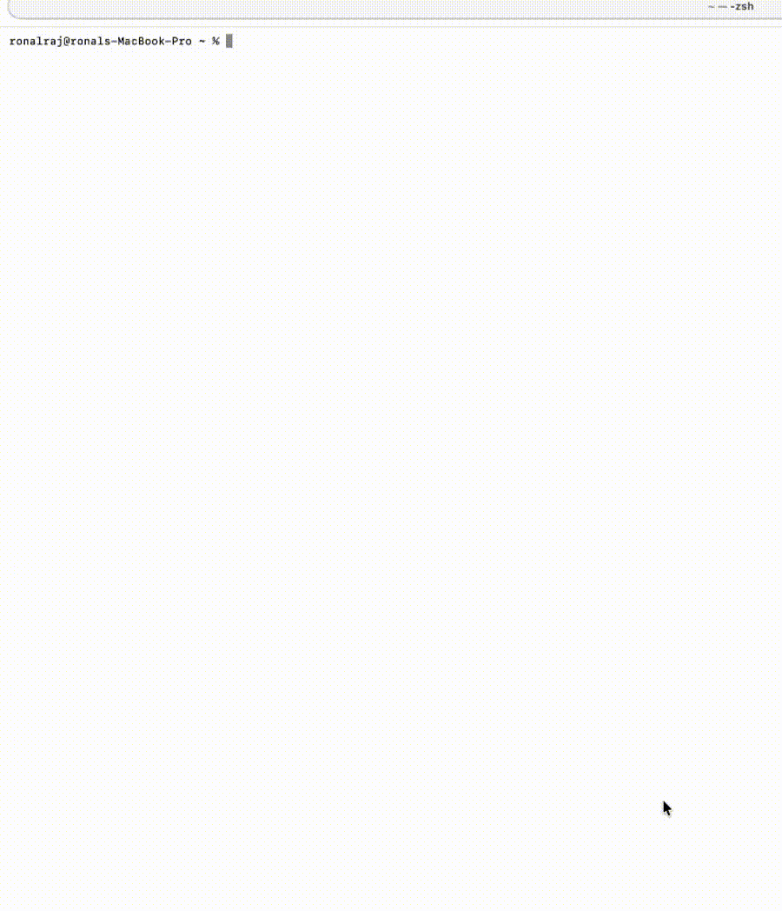

# envsnap

**Stop saying "works on my machine."**

<p align="center">
  
</p>

<p align="center">
  <a href="#install">Install</a> ·
  <a href="#usage">Usage</a> ·
  <a href="#what-gets-captured">What's captured</a> ·
  <a href="#privacy">Privacy</a> ·
  <a href="#roadmap">Roadmap</a>
</p>

---

envsnap captures your local development environment to a single markdown file. Compare it with a teammate's snapshot to find the difference in seconds. Share it in a GitHub issue when CI fails and nobody can reproduce the bug.

## The problem

You open a bug report: "Tests pass locally but fail in CI." You ask the reporter for their Node version, their Docker version, their AWS region. They send screenshots. You squint. An hour later you find they're on Python 3.9 while CI runs 3.11.

Or a new hire joins the team. They clone the repo, run the build, and it explodes. "Works on my machine," you say. They spend a day discovering they need a specific kubectl context, an env var you forgot to document, and a version of Terraform that isn't in the README.

These problems aren't hard. They're just tedious. envsnap makes them trivial.

## Install

**Homebrew** (tap coming soon):
```bash
brew install envsnap
```

**Shell script** (coming with first release):
```bash
curl -fsSL https://raw.githubusercontent.com/ronalships/envsnap/main/install.sh | sh
```

**Go** (works today):
```bash
go install github.com/ronalships/envsnap/cmd/envsnap@latest
```

## Usage

### Capture your environment

```bash
envsnap capture
```

Prints a markdown snapshot to stdout. Pipe it anywhere or save to a file:

```bash
envsnap capture -o my-env.md
```

### Compare two snapshots

```bash
envsnap diff alice.md bob.md
```

Output highlights differences:

```
✗ node      v18.17.0  →  v20.10.0
✗ python    3.9.7     →  3.11.4
✓ docker    24.0.6    =  24.0.6
✗ AWS_REGION us-east-1 →  us-west-2
```

Exit code is `0` if identical, `1` if different — useful in CI.

### Share via GitHub Gist

```bash
envsnap share my-env.md
```

Uploads to a GitHub Gist (using your `gh` auth) and prints the URL:

```
Snapshot shared: https://gist.github.com/ronalships/abc123
```

No file argument? It captures and shares in one step:

```bash
envsnap share
```

## What gets captured

- **System** — OS, kernel version, architecture, shell, terminal
- **CLI tools** — 30+ common tools: git, docker, kubectl, terraform, aws, gcloud, node, python, go, rust, java, ruby, helm, and more
- **Version managers** — nvm, pyenv, rbenv, asdf, rustup, sdkman (with active versions)
- **Environment variables** — keys only by default, values redacted
- **AWS** — profile names and regions from `~/.aws/config` (never credentials)
- **Kubernetes** — context and cluster names from kubeconfig (never tokens or certs)
- **Docker** — client/server version, daemon status, running container count
- **Git** — global `user.name` and `user.email`
- **Dotfiles** — inventory of which dotfiles exist (never their contents)

## Privacy

**Nothing leaves your machine unless you explicitly run `envsnap share`.**

By default, environment variable values are hidden. You see keys only:

```
PATH        [set]
HOME        [set]
AWS_REGION  [set]
```

Sensitive keys are auto-redacted even with `--values`:

- `*KEY*`, `*SECRET*`, `*TOKEN*`, `*PASSWORD*`
- `*CREDENTIAL*`, `*AUTH*`, `*PRIVATE*`, `*ACCESS*`

Custom redaction patterns coming soon:

```bash
# ~/.envsnaprc (planned)
redact = *INTERNAL*, *CORP_*

# or inline (planned)
envsnap capture --redact "*ACME*,*INTERNAL*"
```

envsnap never reads file contents — only checks which files exist. It never reads `~/.aws/credentials`, SSH private keys, or anything that could leak secrets.

## Use cases

- **Debug "works on my machine"** — capture both environments, diff, find the culprit
- **CI failure investigations** — paste your snapshot in the PR comment
- **Onboard new developers** — share a known-good snapshot as the target setup
- **Reproduce bug reports** — ask reporters to attach their envsnap output
- **Before/after upgrades** — snapshot before a big Homebrew update, diff after

## Roadmap

- [ ] v0.1.0 release with pre-built binaries
- [ ] Homebrew tap
- [ ] More detectors (Podman, Colima, mise, volta)
- [ ] JSON output format (`--format json`)
- [ ] Custom detector plugins

## Contributing

Contributions welcome! Whether it's a bug report, a feature request, or a PR — all appreciated.

- Found a bug? [Open an issue](https://github.com/ronalships/envsnap/issues)
- Want a new detector? Suggest it in an issue or send a PR to `internal/detector/`
- See [CONTRIBUTING.md](CONTRIBUTING.md) for guidelines

## License

[MIT](LICENSE)

---

<p align="center">
  Built by <a href="https://x.com/RonalRaj4">@RonalRaj4</a> on X.<br>
  Star the repo if envsnap saved you time.
</p>
